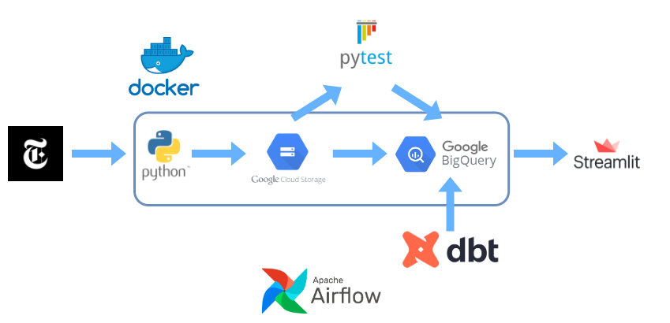

# New York Times ETL Pipeline
**An EtLT pipeline that uses the API from New York Times to ingest data of the articles published into a Google Storage bucket to feed into a BigQuery database, with the data modeling done through dbt. The pipeline is then run daily through Airflow to ultimately update two dashboards I wanted to test (Streamlit and Tableau).

# Architecture Diagram

1. Pull the data from the API using Python, then transform it into tabular form
2. Connect to Google Storage bucket and load the data into it
3. Check for data integrity issues using pytest
4. Create the data models in dbt
5. Visualize the data using Streamlit
6. Schedule this process to repeat through Airflow

# Prerequisites

* Python 3.9
* Docker 20.10.9
* Docker-compose 1.29.2
* Git

# Contact

Feel free to get in touch about anything! [Andrew Kim](https://www.linkedin.com/in/andrew-sungsoo-kim/)
